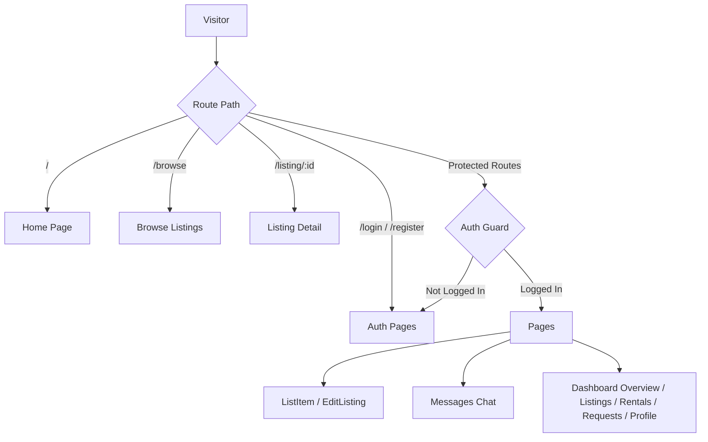
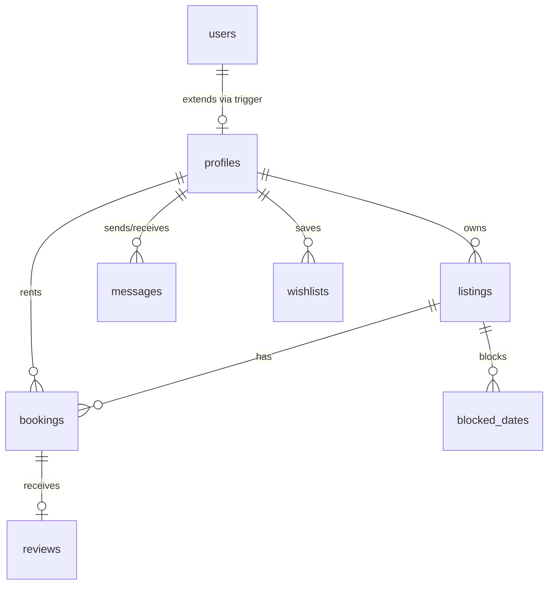

# 🧠 RentItOut - Single Source of Truth

Welcome to the `brain.md` for **RentItOut**. This document serves as the project's single source of truth, enabling developers and AI agents to quickly understand the entire project without scanning the entire codebase.

---

## 1. Project Overview

* **Project Name**: RentItOut
* **Purpose & Problem It Solves**: Peer-to-Peer (P2P) equipment rental marketplace. It allows owners to monetize underutilized gear (tools, cameras, camping equipment) and provides renters with affordable, local access to items they only need temporarily, reducing waste and cost.
* **Target Users**:
  - **Lenders/Owners**: Individuals or small businesses looking to rent out their tools, photography gear, sports equipment, etc.
  - **Renters**: DIYers, hobbyists, photographers, or travelers needing short-term access to specialized equipment.
* **Core Features**:
  - Search & filter listings by category, location, and price.
  - Interactive calendar booking with dynamic duration/cost calculations.
  - Direct P2P real-time messaging contextualized by listings.
  - Dynamic user dashboard tracking earnings, active rentals, requests, and listings.
  - User review and rating system.
  - Security with Supabase Row Level Security (RLS) protecting user resources.
* **Current Development Status**: Ready for local development and testing. Frontend is fully functional and connected to a live Supabase instance containing migrations for tables, triggers, and policies.

---

## 2. Tech Stack

* **Frontend Framework**: React 19 (TypeScript)
* **Backend Framework**: Serverless / Supabase Client SDK
* **Database**: PostgreSQL (hosted on Supabase)
* **Authentication**: Supabase Auth (Email & Password)
* **State Management**: Zustand (with session persistence using `persist` middleware)
* **Styling System**: Tailwind CSS v4 (configured via `@tailwindcss/vite` plugin)
* **Build Tools**: Vite 7 & TypeScript compiler (`tsc`)
* **Deployment Platform**: Netlify, Vercel, or static web hosts (Vite static output)
* **External Services / APIs**: Supabase API (Database, Auth, and Storage)

---

## 3. Folder Structure

```text
rentitout/
 ├── .bolt/                  # Bolt.new configuration metadata
 ├── public/                 # Static public assets (Vite logo, static images)
 ├── supabase/               # Database configurations & migrations
 │    └── migrations/        # SQL files defining schema, tables, policies, and triggers
 ├── src/
 │    ├── components/
 │    │    ├── auth/         # Auth forms, protected route guards
 │    │    ├── layout/       # Navbar, Footer, Dashboard sidebar layouts
 │    │    ├── listings/     # Listing cards, edit forms, booking widgets
 │    │    ├── shared/       # ScrollToTop, user avatars, empty-state screens
 │    │    └── ui/           # Shadcn raw UI primitives (buttons, inputs, etc.)
 │    ├── hooks/             # Custom React hooks (e.g. useAuth, use-mobile)
 │    ├── lib/
 │    │    ├── supabase.ts   # Supabase client instantiation & TS typings
 │    │    └── utils.ts      # Tailwind class merging & formatting utils
 │    ├── pages/
 │    │    ├── Dashboard/    # Dashboard (Overview, Listings, Requests, Profile)
 │    │    ├── About.tsx     # "About Us" information page
 │    │    ├── Browse.tsx    # Browse listing grid with sidebar filters
 │    │    ├── EditListing.tsx # Form to update existing listing properties
 │    │    ├── Home.tsx      # Main landing page with search, categories, & featured items
 │    │    ├── ListItem.tsx  # Multi-step "list a new item" creation flow
 │    │    ├── ListingDetail.tsx # Public item detail, calendar, and owner contact details
 │    │    └── Messages.tsx  # Unified chat system (sidebar + chat pane)
 │    ├── store/
 │    │    └── index.ts      # Zustand auth state and global UI stores
 │    ├── App.tsx            # Routes definition and layout wrappers
 │    ├── index.css          # Tailwind custom utility variables & styles
 │    └── main.tsx           # Application entrypoint
 ├── .env                    # Local environment keys (Supabase - ignored by git)
 ├── .env.example            # Template for environment keys
 ├── vercel.json             # Vercel deployment configuration for single-page routing
 ├── package.json            # Scripts & dependencies definition
 └── vite.config.ts          # Vite bundler options
```

---

## 4. Architecture

### Application Flow & Routing


### Data Flow (Supabase Sync)
1. **User Authentication**: Login/Register requests go to `supabase.auth`. Successful response automatically updates `useAuthStore` and triggers a database trigger function `public.handle_new_user()` to populate the `profiles` table.
2. **Read/Write Operations**: Components call the unified client instance `supabase` in `src/lib/supabase.ts` directly.
3. **Real-time Synchronization**: Database Row Level Security (RLS) filters query results automatically based on the user's active session JWT.

---

## 5. Features

* **Authentication & Profiles**
  - [x] Email & password sign up and login
  - [x] Auto-generation of public profiles on auth signup
  - [x] Edit user profile details (city, phone, bio, avatar)
* **Listing Directory**
  - [x] Search listings by title, description, or tags
  - [x] Filter by category, location/city, condition, and price range
  - [x] Sort by date created or price
* **Rental Operations**
  - [x] Calendar picker indicating blocked (already booked) dates
  - [x] Multi-step listing creation with image uploads
  - [x] Booking request submission with customized messages
  - [x] Owner management of bookings (Accept / Decline)
  - [x] Listing visibility toggle (Active / Inactive)
* **Real-time Messaging**
  - [x] Threaded peer-to-peer chat system
  - [x] Direct context matching (messages linked to specific listings)
  - [x] Mark messages as read/unread
* **State & Performance**
  - [x] Local storage cache for active user profiles (Zustand persist)
  - [x] Skeleton loaders for browse & listings

---

## 6. Routes

| Route | Component | Access | Description |
| :--- | :--- | :--- | :--- |
| `/` | `Home.tsx` | Public | Hero introduction, search, popular categories, and latest listings. |
| `/browse` | `Browse.tsx` | Public | Listings catalog with interactive sidebar filters and query search. |
| `/listing/:id` | `ListingDetail.tsx` | Public | Details, reviews, rating summary, owner profile, and booking calendar. |
| `/about` | `About.tsx` | Public | Informational page explaining how RentItOut works. |
| `/login` | `Login.tsx` | Public | Authentication page for logging in. |
| `/register` | `Register.tsx` | Public | Authentication page to register a new user. |
| `/forgot-password` | `ForgotPassword.tsx` | Public | Form to recover forgotten passwords. |
| `/list-item` | `ListItem.tsx` | Protected | Creation form for listing new rental gear. Includes image uploads. |
| `/edit-listing/:id` | `EditListing.tsx` | Protected | Update title, descriptions, price, deposit, condition, or visibility. |
| `/messages` | `Messages.tsx` | Protected | Real-time messaging panel to contact item lenders. |
| `/dashboard` | `DashboardOverview` | Protected | High-level statistics on earnings, active listings, and bookings. |
| `/dashboard/my-listings` | `MyListings.tsx` | Protected | Management list to view, toggle state, or delete owned listings. |
| `/dashboard/my-rentals` | `MyRentals.tsx` | Protected | Rental logs detailing items, rental dates, prices, and status. |
| `/dashboard/requests` | `Requests.tsx` | Protected | Dashboard tab to accept or decline incoming renter requests. |
| `/dashboard/profile` | `Profile.tsx` | Protected | User metadata updates (name, location, avatar, contact phone). |

---

## 7. Components

### Layout Components
- **Navbar** (`src/components/layout/Navbar.tsx`): Header container with global navigation links, dynamic search bar, notifications, and mobile hamburger drawer.
- **Footer** (`src/components/layout/Footer.tsx`): Persistent footer with category directories, site links, and newsletters.

### Custom Component Primitives
- **ListingCard** (`src/components/listings/ListingCard.tsx`): Card item for display grids, showing item images, title, price, location, condition, and a wishlist heart button toggle.
- **StarRating** (`src/components/shared/StarRating.tsx`): Renders star reviews with average decimal ratings.
- **UserAvatar** (`src/components/shared/UserAvatar.tsx`): Displays dynamic fallback letter avatars if an image URL is absent.
- **ProtectedRoute** (`src/components/auth/ProtectedRoute.tsx`): Wraps components to redirect unauthorized users to the `/login` route.

---

## 8. Database Schema

The database consists of 7 main PostgreSQL tables on Supabase:

### Database Diagrams



### Table Definitions

1. **`profiles`**
   - Extends Auth user schemas. Contains: `id (uuid, PK)`, `name (text)`, `avatar_url (text)`, `phone (text)`, `city (text)`, `bio (text)`, `is_verified (boolean)`, `created_at (timestamptz)`.
2. **`listings`**
   - Equipment for rent: `id (uuid, PK)`, `title (text)`, `description (text)`, `category (text)`, `condition (text)`, `price_per_day (numeric)`, `min_days (int)`, `max_days (int)`, `deposit (numeric)`, `rules (text)`, `city (text)`, `area (text)`, `images (text[])`, `is_active (boolean)`, `owner_id (uuid, FK)`, `view_count (int)`.
3. **`bookings`**
   - Rental requests: `id (uuid, PK)`, `start_date (date)`, `end_date (date)`, `total_days (int)`, `total_price (numeric)`, `status (text: PENDING, ACCEPTED, DECLINED, COMPLETED, CANCELLED)`, `message (text)`, `renter_id (uuid, FK)`, `listing_id (uuid, FK)`.
4. **`reviews`**
   - Rating feedbacks: `id (uuid, PK)`, `rating (int [1-5])`, `comment (text)`, `author_id (uuid, FK)`, `listing_id (uuid, FK)`, `booking_id (uuid, FK, UNIQUE)`.
5. **`messages`**
   - Chats: `id (uuid, PK)`, `content (text)`, `sender_id (uuid, FK)`, `receiver_id (uuid, FK)`, `conversation_id (text)`, `listing_id (uuid, FK)`, `read (boolean)`.
6. **`blocked_dates`**
   - Calendaring exclusion: `id (uuid, PK)`, `date (date)`, `listing_id (uuid, FK)`.
7. **`wishlists`**
   - Saved items: `id (uuid, PK)`, `user_id (uuid, FK)`, `listing_id (uuid, FK)`.

---

## 9. API / Queries Documentation

Because the project communicates directly via the Supabase client SDK without separate custom REST controllers, database transactions are executed client-side. The standard interaction patterns are:

* **Authentication Operations**:
  - `supabase.auth.signUp({ email, password, options: { data: { name, city } } })`
  - `supabase.auth.signInWithPassword({ email, password })`
* **Query Listings**:
  - `supabase.from('listings').select('*, owner:profiles(*)').eq('is_active', true)`
* **Submit Bookings**:
  - `supabase.from('bookings').insert({ listing_id, renter_id, start_date, end_date, total_price })`
* **Realtime Chat Sync**:
  - Subscribes to the `messages` channel filtering on `conversation_id`.

---

## 10. Environment Variables

| Variable | Required | Description | Example |
| :--- | :--- | :--- | :--- |
| `VITE_SUPABASE_URL` | Yes | The target URL endpoint for your Supabase backend project. | `https://your-project.supabase.co` |
| `VITE_SUPABASE_ANON_KEY` | Yes | The public anonymous key for authentication and database calls. | `eyJhbGciOiJIUzI1NiIsInR5cCI6IkpXVCJ9...` |

---

## 11. External Dependencies

- **`@supabase/supabase-js`**: Interacts with database tables, manages authentication sessions, and subscribes to real-time WebSockets.
- **`zustand`**: Lightweight global state management containing user profiles and UI sidebar layout toggles.
- **`react-router-dom`**: Configures path parameters, sub-routes, layout outlets, and handles client navigation.
- **`react-hook-form` & `zod`**: Controls listing forms, inputs, dynamic errors, and handles client-side input validations.
- **`lucide-react`**: Renders dynamic, responsive iconography.

---

## 12. Coding Conventions

- **Component Format**: Always write components using functional TypeScript (`.tsx`) files.
- **Styling**: Restrict to utility styling inside Tailwind CSS v4. Design custom components with `cn()` merge helper.
- **State Boundaries**: Keep state local when possible (using React's `useState`). Elevate to Zustand stores only for global properties like `Auth` and `UI` context.
- **Error Boundaries**: Enclose operations interacting with external APIs (like Supabase uploads) inside standard `try { ... } catch (error) { ... }` blocks with descriptive toast messages (`sonner`).

---

## 13. Development Workflow

### Scripts Overview

| Command | Action |
| :--- | :--- |
| `npm run dev` | Runs the application in development mode (`vite`) |
| `npm run build` | Bundles all source files into `/dist` for static deployment (`tsc -b && vite build`) |
| `npm run typecheck`| Runs the TypeScript compiler checking for syntax/typing bugs without output (`tsc --noEmit`) |
| `npm run preview` | Spins up a local server to inspect production bundle assets |

### Running the App
1. Verify the project dependencies: `npm install`
2. Create or verify the environment keys: check `.env` configuration.
3. Start the dev environment: `npm run dev`
4. Access the web interface at: `http://localhost:5173/`

---

## 14. Current Progress

- **Current Milestone**: Stable prototype with Supabase connection.
- **Recent Changes**:
  - Created a robust developer [README.md](file:///c:/Users/Hp/OneDrive/Desktop/rentitout/README.md) file detailing application structure.
  - Custom page header styling modified inside `index.html`.
- **Known Issues**:
  - Image size compression is not managed client-side before file upload. Large uploads can exceed the default Supabase Storage limits.
- **Next Priorities**:
  - Implement client-side image compression in `ListItem.tsx` page before uploading to storage.
  - Implement payment gateway integration checkout flows.

---

## 15. Decision Log

- **Decision**: Used Client-Side Direct Queries (Supabase SDK) instead of custom backend APIs.
- **Rationale**: Direct connection enables quick feature prototyping, simplifies hosting requirements (static hosting), and delegates authentication & data access control to Supabase database policies.

---

## 16. AI Agent Notes

When modifying the application, please adhere to these rules:
1. **Database Modifiers**: Avoid modifying the database schemas unless specifically requested. Schema upgrades require SQL scripts in the `supabase/migrations/` directory.
2. **Authentication Guards**: Do not bypass the `ProtectedRoute` component for dashboard subroutes or list-item edits.
3. **Environment Setup**: Ensure your changes do not leak credentials. Double-check that `.env` is listed inside `.gitignore`.
4. **Tailwind v4 Guidelines**: Tailwind v4 configuration is managed inside `src/index.css`. Avoid creating deprecated Tailwind classes or trying to modify standard v3 configuration files.
5. **Validation Verification**: Always test input components using the corresponding validation boundaries defined in schemas.
